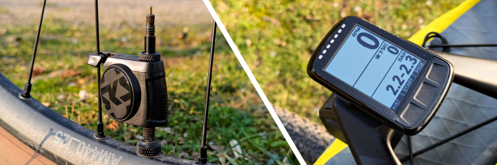
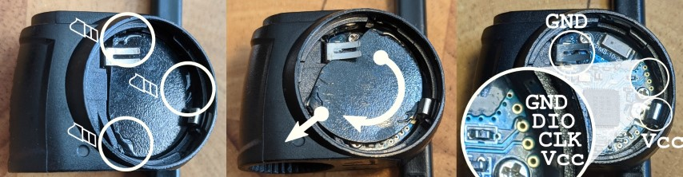
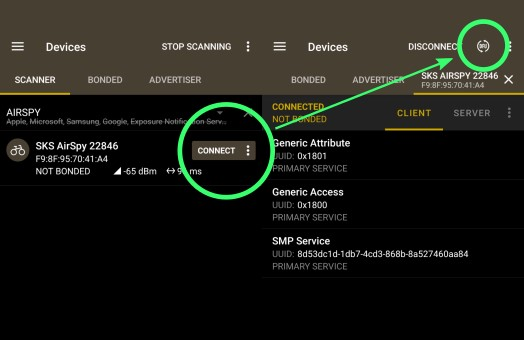

# SKS*[1](#disclaimer)* AIRSPY*[1](#disclaimer)* ANT+*[2](#disclaimer)* Community Firmware
An alternative firmware for the SKS AIRSPY tire pressure sensor. Implementing a device profile compatible with the - not yet officially released - ANT+ TPMS (Tyre/Tire Pressure Monitoring System) device profile, as implemented by major cycling computer manufacturers.

## What is it and why do I want it?
Stock SKS AIRSPY sensors only talk to a proprietary companion app on Android, iOS or Garmin devices. They do not implement any industry standard to provide the tire pressure information. Let's change this! With this firmware, your AIRSPY sensors seamlessly integrate with a range of cycling computers supporting the ANT+ TPMS profile, providing real-time tire pressure monitoring without need for a proprietary app.

You may want this, if you like some more gadgets on you bike, own a bike computer, like some tinkering, and because these can be had second hand for as low as 30€ a pair. As the sensor uses a nRF52832 for communication, implementing and flashing new firmware is pretty straightforward, as development tools are openly accessible.

### Features
* ANT+ TPMS compatible device profile (non certified)
  * Battery state and cummulated operating time (ANT common page 82)
  * Software Version (ANT common page 81)
  * Manufacturer Info (default values) (ANT common page 80)
* OTA DFU: firmware updates over BLE; using DFU in [nRF Connect](https://www.nordicsemi.com/Products/Development-tools/nRF-Connect-for-mobile) mobile app
* Debug Logging over BLE; using Nordic UART Service in [nRF Toolbox](https://www.nordicsemi.com/Products/Development-tools/nRF-Toolbox) mobile app
* Power consumption: [276µA while operating](./doc/resources/ppk-20250206T233534_ON_2.png), [19µA idle](./doc/resources/ppk-20250206T233615_IDLE_2.png); max. 33 days continuous operation, 482 days standby @ 220mAh battery

*OTA DFU and logging over BLE services are only available to connect to **within 30 seconds** after a cold-boot (removing and re-installing battery).*

### Hardware compatibility
Please report other hardware configurations, board revisions, etc. you find out in the wild.

| Product | Board (rev.) | SoC | |
|---|---|---|---|
| AIRSPY | TPMS-10-2 | nRF52832 | ✅ |

### Tested ANT+ Displays (Devices):
| Device | Tire Pressure | Battery | Software Info | Manufacturer Info | Comments |
|---|---|---|---|---|---|
| Wahoo ELEMNT Bolt | ✅ | ❌ | ✅ | ❌ | |
| [IpSensorMan](http://www.iforpowell.com/cms/index.php?page=ipantman)| ✅ | ✅ | ❌ | ✅ | [Garmin USB ANT Stick](https://www.garmin.com/en-US/p/10997) on Android 13 |

## Installation
The stock firmware provides wireless update capabilities. Sadly, we cannot use it to load our own firmware, as the update payload has to be signed, and only SKS knows the private key to do so. To flash this firmware we need physical access to the programming interface (SWD port) and a programmer.

*If you are more into biking than into tech, now is a good time to call that one friend.*

### Warnings
> ⚠ The installation requires you to open up the hardware. All warranty will most likely be lost in this process. You may brick the device in the process. Proceed at own risk!

> ⚠ To revert to the original firmware, you have to jump some hoops; [read here first](./doc/INSTALL.md)! Consider reverting to original firmware as impossible! Proceed at own risk!

> ⚠ The ID of the sensor will change and not match the laser engraving on the bottom anymore! The original IDs are hardcoded into firmware and do not seem to relate to any hardware ID, BT-MAC, etc.

### SWD Access
Tools you need:
* Cutter / X-Acto
* Sturdy tweezers or small pliers
* Spudger
* SWD programmer, compatible with the nRF5 series
* Something to attach to the SWD port: 4-Pin 1.27mm spacing pogo adapter, pin header, probe clips, etc.

1. Open up the battery compartment and remove the battery
2. Cut, or break by prying on the cover, the three glue blobs
3. Twist the cover clockwise, best while pulling it slightly upward, as it is held down by an adhesive foam
4. Take out cover
5. Connect your programmer according to its documentation/pin-out

The SWD port is the top-right unpopulated four pin connector. Pin-out:
1. `GND`
2. `DIO`/`SWDIO` Serial Wire Data I/O
3. `CLK`/`SWCLK` Serial Wire Clock
4. `Vcc` up to 3.3V

To connect the programmer, one of the best options is using the battery tabs to connect power supply with some clips. This should allow to connect two jumper (DuPont) wires to `DIO` and `CLK`, just pushing them to the pads with your fingers.

### Flashing
> ℹ If you cannot detect any device on the SWD bus, cut power to the sensor for some seconds and turn it on again. The sensor will turn off after ~10 minutes.

1. Find a release on the release page and download the `.hex` file.
2. Use the tooling of your choice to connect to the SWD port
3. Unlock and erase the chip
4. Flash the `.hex` file you obtained earlier
5. 🎉

> ℹ More information and examples in [INSTALL.md](./doc/INSTALL.md)

## Updating
If you already have a version of this firmware on your sensors, you can update wirelessly (OTA DFU) using your mobile phone:

1. Find a firmware release on the release page and download an update package `.zip` file to your phone
2. Install and open [nRF Connect](https://www.nordicsemi.com/Products/Development-tools/nRF-Connect-for-mobile) mobile app
3. Remove battery from sensor for some seconds (up to a minute)
4. Re-install battery
5. Using nRF Connect app, find and connect to the sensor **within 30 seconds** of inserting the battery
6. Start firmware update by tapping the **DFU** button and selecting the update package

## Inside the Hardware
More info about the internal workings of the sensor and another part of the story of this project can be found in [`./doc/HARDWARE_PROTO.md`](./doc/HARDWARE_PROTO.md).

## Developing & Debugging
For development you need the nRF SDK, matching toolchain, the [ANT SDK](https://www.thisisant.com/APIassets/ANTnRFConnectDoc/) (need to register and [become an ANT adopter](https://www.thisisant.com/my-ant/join-adopter) for this). Additionally, for the current version of the ANT SDK (*1.3.0*) you need to [patch the SDKs](./ant_sdk_nrf52832.patch) `Kconfig` to allow builds for the nRF52832 SoC. You will need to generate your own signing key as well. As the images are signed, you will not be able to use the OTA DFU functionality to flash your own build.

For development on your bench, a RTT console is provided over SWD. Memory location is unknown, as the Black Magic probe did pick it up automatically.

For debugging in operation, logging over BLE - using Nordic UART Service in [nRF Toolbox](https://www.nordicsemi.com/Products/Development-tools/nRF-Toolbox) mobile app - is provided. As with updating, connect to the console **within 30 seconds** after a cold-boot (remove and re-install battery).

## TODO
- [ ] Release from CI
- [ ] Write development documentation / article
- [ ] Clean up code
- [ ] [Migrate to sysbuild](https://docs.nordicsemi.com/bundle/ncs-latest/page/nrf/releases_and_maturity/migration/migration_sysbuild.html)
- [ ] [Testing using BabbleSim](https://docs.zephyrproject.org/latest/boards/native/nrf_bsim/doc/nrf52_bsim.html)
- [ ] Thank everybody I pestered with this project for too long

## License
Most of the sources are licensed under [MPL-2.0](https://www.mozilla.org/en-US/MPL/2.0/), parts under [Apache-2.0](https://www.apache.org/licenses/LICENSE-2.0) or [Nordic-5-Clause](https://devzone.nordicsemi.com/cfs-file/__key/communityserver-blogs-components-weblogfiles/00-00-00-00-04-DZ-1122/0333.5_5F00_Clause_5F00_Nordic_5F00_License_5F00_text.txt) license.

## Disclaimer
This is a non-commercial project; the provided binary variant of the software uses the development ANT license key.

1\. The names SKS (SKS Germany) and AIRSPY are registered trademarks of SKS metaplast Scheffer-Klute GmbH. The names are solely used to describe compatibility of this software.

2\. ANT+ is a registered trademark of Garmin Canada Inc. This software/product is not ANT+ certified and does not claim compliance. The name ANT+ is solely used to describe parts of the functionality of this software.
