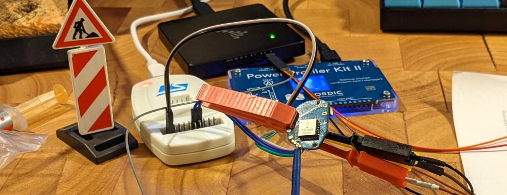
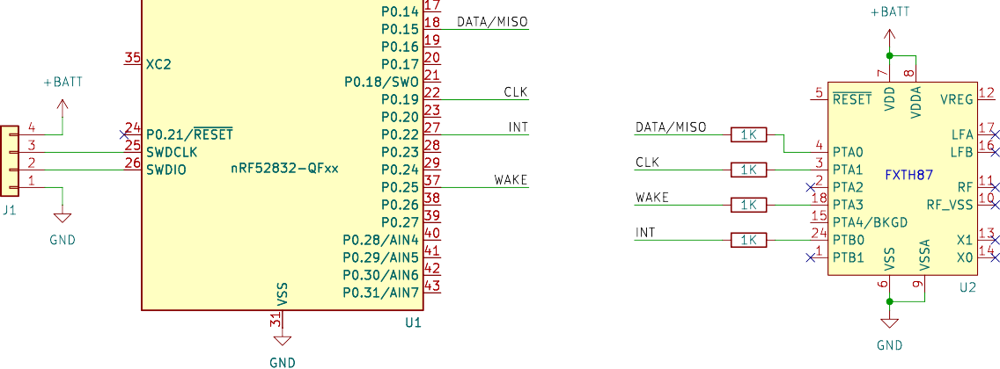
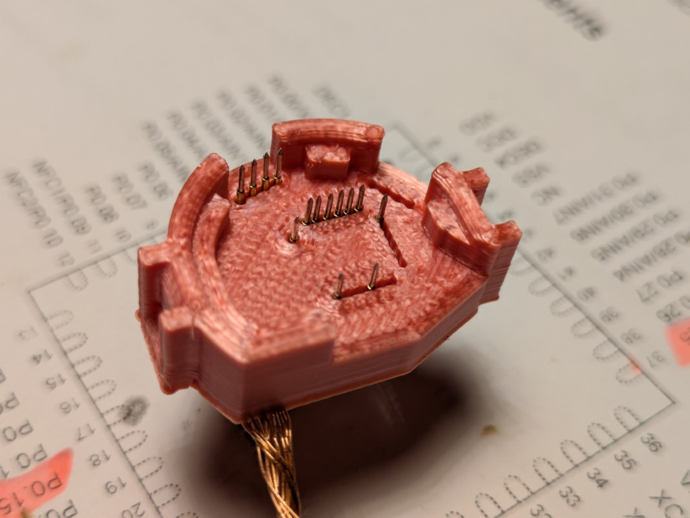
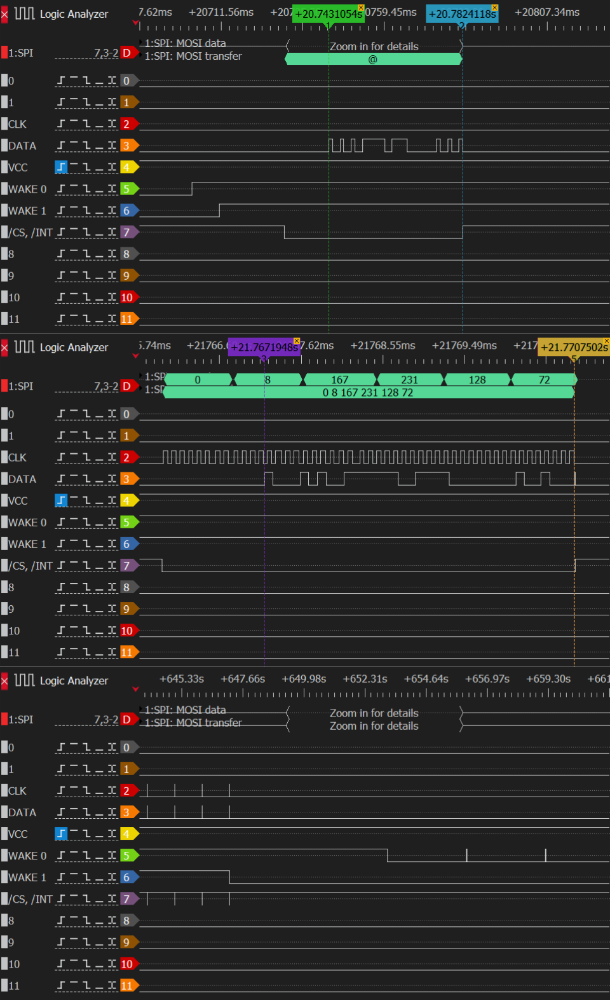
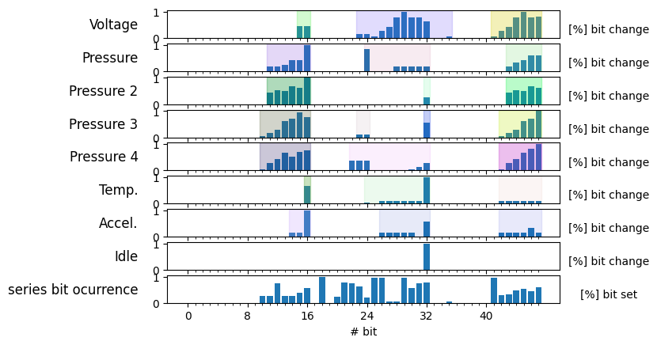

# SKS AIRSPY Hardware and on-Board Communications


This document describes the important hardware parts of the sensor, their function and their communication. And the story of how and why we know.

## Hardware Components
The board hosts a *Nordic nRF52832* SoC for 2,4GHz BLE and ANT communications and a *Freescale/NXP FXTH87* series tire pressure monitoring (TPMS) SoC, as pressure, voltage and temperature sensor (but we don't really know this by now). Both are easily identified after disassembly by their markings on the package, or - without disassembly - by finding the [internal photos of FCC report 2ASEG-1161A](https://fcc.report/FCC-ID/2ASEG-1161A/4672637). This is the way I went before buying a pair of the sensors and decided to tackle this project at all.

### FXTH87 (bottom side)
FXTH87 series SoCs are fully integrated TPMS solutions. They include own RF communication systems and a programmable MCU. They are intended to be used stand-alone with their low frequency, but longer range radios, compared to 2,4GHz radios. And this is where the problem begins: Without flashing any software, these SoCs won't do anything. But why is this a problem? We cannot just take a look at the data-sheet and understand what the device does. We can look at data-sheets and documentation and get an idea of what the device is theoretically capable of, but not what the currently flashed firmware makes it do. Documentation used to determine the workings are [1, 2]. For now we know from the documentation, that this device can sense pressure, temperature, supply voltage, has at least one accelerometer and a number of GPIOs. The goal is to not touch this device more than necessary and to not write any software for an arcane NXP 8-bit MCU with proprietary programming/debugging interface.

#### Documentation
1. [**FXTH87xx02 Embedded Firmware User Guide; Rev. 2.2 — 5 April 2017**](https://www.nxp.com/docs/en/user-guide/FXTH87xx02FWUG.pdf)
2. [**FXTH87E, Family of Tire Pressure Monitor Sensors; Reference manual; Rev. 6.1 — 21 June 2021**](https://www.nxp.com/docs/en/reference-manual/FXTH87ERM.pdf)
3. **Correspondence between compensated sensor data and data in common units Rev. 4**; from *TPMS Demo BLE Beacons by GenFSK*; available via [NXP here](https://www.nxp.com/products/FXTH87)

### nRF52832 (top side)
The nRF5 series controllers are well known and documented ARM Cortex M4 SoCs with 2,4GHz radios. The development tools are openly available and the SoC packs most functions and peripherals you would expect. The nRF provides BLE and ANT communications for the sensor. It is the target for new firmware to implement ANT communications compatible with a new device profile. The nRF allows most peripherals to be used on any pin (except e.g. power supply, oscillator or radio of course), thus the wiring does not allow drawing any conclusions about the performed function of the pins.


## Communications (Bus)



Both SoCs do have to communicate with each other - at least uni-directionally - to make use of each others functions. Figure above shows the connection between them, as probed with a multimeter. The nets are already named by their function, which in reality, we have to find in the next steps. To capture all interaction and possibly missed connections, a bed-of-nails fixture was built, to connect to all logic pins, as well as reset and Vcc, of the FXTH87. The figures below show the - already labeled - captured data for all probed pins for:
1. startup
2. single data transmission event
3. shutdown



### Analysis: The awakening
Looking at the first and last presented trace, we can easily identify the signal used to enable and disable the system. Looking at the first and third trace, we find two signals (`WAKE0` and `WAKE1`) going high when powering on the sensor, and going low after the documented timeout of ~10 minutes. `WAKE0` periodically goes high for ~3s every ~3m when the sensor is off. In operation and with stock firmware, the sensor wakes up when being moved. As the FXTH87 includes an accelerometer, and the nRF52 does not, the former has to be responsible for providing data about when to wake up and go to sleep. As no data is exchanged when sleeping, even when `WAKE0` is periodically high, the FXTH87 has to have full authority to control both `WAKE0` and `WAKE1` to wake up the nRF52. *This has been confirmed with experiments not presented in the traces above.* As `WAKE0` is not connected to the nRF52 on the board, we obtain following result:

`WAKE1`, connected to FXTH87 `PTA3`(18) and nRF52 `P0.25`(37) signals to the nRF52 when the sensor shall wake and sleep.

### Analysis: The great deception
The second trace shows a seemingly standard SPI communication and allows to identify and label the signals for clock (`CLK`) data (`DATA`) and a chip select (`/CS, /INT`). Now, we have to find who is master and who is slave. The nRF52 has peripherals for SPI master and slave, so both is possible in theory. Let's take a look at the FXTH87 documentation [1], section 2.4:
> #### 2.4 Simulated SPI interface signal format
> The FXTH87xx02 includes three routines (`TPMS_MSG_INIT`, `TPMS_MSG_READ` and `TPMS_MSG_WRITE`) that, when used together, allow the user to perform serial communication with the device through a simulated SPI interface. The following assumptions are made:
> * Only two pins are used: `PTA0` for data (both incoming and outgoing) and `PTA1` for clock. No slave select is included by default, but the user may use any other pin if required.
> * The data pin has a pullup resistor enabled.
> * The FXTH87xx02 will be a master device (the FXTH87xx02 will provide the clock).
> * Data can be read/written eight bits at a time.
> * Speed of the interface is dependant on bus clock settings.
> * Data is transferred MSB first.
> * A single line will be used for both sending and receiving data (`BIDIROE = SET` according to NXP nomenclature).
>   * At the clock's rising edge, the master will place data on the pin. It will be valid until the clock's falling edge. The slave must not drive the line during this period.
>   * At the clock's falling edge, the master will make the data pin an input and will "listen" for data. The slave must then place data on the data line until the clock's rising edge.
> * Clock Polarity = 0 (Normally low).
> * Clock Phase = 1 (First half is high).

We learn: A (simulated/software) SPI interface is present, `PTA0` is data line, `PTA1` is clock, no slave/chip select by default and FXTH87 is the SPI master. The described pin-out does match the hardware, so this should be a first success - right?

When implementing a SPI slave on the nRF52, the communications look like in the startup sequence in the first trace above: The clock is missing and the data is written to the line about 10x slower than expected (trace two). With a missing clock, the nRF52 as a SPI slave does obviously never receive any data. What's wrong? Didn't the documentation tell us the FXTH87 will be the SPI master?

### Analysis: (Not so) Grand Finale
> In reality, the following took way longer than it should have taken.

The answer is really quite simple, and the startup sequence in trace one does give us a hint: The nRF52 is not fully booted when `/CS,/INT` is driven low by the FXTH87, and cannot react to the event. The event is not a chip select, but an interrupt signal, as a request to send data. The FXTH87 is actually a SPI slave and the nRF52 is the master, reacting to an interrupt event! But, if no clock is provided, the data will be written to the line none the less. As shown by experiments, the frequency of the clock does matter as well: The nRF52832 SPI Master minimum clock frequency of 125 kHz is ~10x higher than the frequency used by the stock sensor, and too damn high! The FXTH87 is not capable of clocking out the data at this frequency. Thus, the later implementation will use a bit-bang SPI master.

Following table summarizes the findings:

| Signal | Description | nRF Pin (#) | FXTH Pin (#) |
|---|---|---|---|
| SPI CLK | clock @ 10.37 kHz; provided by nRF | `P0.19`(22) | `PTA1`(3) |
| SPI MISO | unidirectional data; sent by FXTH | `P0.15`(18) | `PTA0`(4) |
| SPI /INT | interrupt to request data transfer; driven by FXTH | `P0.22`(27) | `PTB0`(24) |
| WAKE | operational state of the device; controlled by FXTH | `P0.25`(37) | `PTA3`(18) |


## Data Decoding
Now, that we have identified how data is exchanged between both systems, we have to make sense of the exchanged data. Interpreting the data is easier if we can make some - hopefully correct - educated guesses and formulate expectations or even a hypothesis. First, the second trace above shows us, that we get 6 Bytes of data per transmission. To build a hypothesis, let's look at [1], where we find some information in the documented methods relating to the TPMS functions:

| Name | Description |
|---|---|
| `TPMS_COMP_VOLTAGE`     | 8-bit compensation of 10-bit voltage reading |
| `TPMS_COMP_TEMPERATURE` | 8-bit compensation of 10-bit temperature reading |
| `TPMS_COMP_PRESSURE`    | 9-bit compensation of 10-bit pressure reading |
| `TPMS_COMP_ACCELERATION`| 9-bit compensation of 10-bit acceleration reading |
| `TPMS_CHECKSUM_XOR`     | Calculates a checksum for given buffer in XOR |
| `TPMS_CRC8`             | Calculates CRC8 on portion of memory |
| `TPMS_CRC16`            | Calculates CRC16 on portion of memory |

All these methods operate exclusively on integral types!

### Building a hypothesis
1. No particular protocol, just packed data
2. **Pressure** data occupies at least 9 bits; expected 16 bits for 8 bit alignment
3. **Temperature** data occupies 8 bits; if present
4. Supply **Voltage** data occupies 8 bits; if present
5. **Acceleration** data occupies at least 9 bits; expected 16 bits for 8 bit alignment; if present
6. If present, a **checksum** is calculated as either of: CRC8, CRC16, XOR

Not all of this will fit in our 6 Byte transaction. So, on to some experiments to find what is present!

### Performing experiments
To find out, which information is present in the data, we can systematically vary all measurable parameters one by one. For each experiment, an unspecified number of transactions is recorded. The figure below shows the normalized percentage of changes per bit per experiment and the normalized overall percentage of each bit being set.


> ⚠ The temperature (Temp.) experiment was designed wrong and did not yield any meaningful data!

For all experiments, clusters are built from the bit change statistics, using [Mean Shift clustering](https://scikit-learn.org/stable/auto_examples/cluster/plot_mean_shift.html). The resulting clusters are highlighted in the figure above.

#### Finding 1: Checksum
All traces show a cluster at the end of each transaction - a common place for checksuma. Interestingly, the (geometric) shape of the cluster resembles a combination of the other clusters in the respective experiment. From the available checksum calculation methods, this matches application of `XOR` most closely.

Applying `XOR` over the first 5 Bytes of all transactions, yields a result matching the potential checksum in most cases. But only most! At times, the first bit of the checksum in the transaction and the calculated checksum do not match. Looking at the statistics, we find the cluster to be of an unusual width of only 7 bits. What's wrong here?

#### Finding 2: (Shape-) Shifting
Finding the pattern, as present in the second trace above, took way too long... But let's take a look: **After** the last clock pulse, we find another short pulse on the data line. Beginning just after the clock goes low and ending nearly in sync with the interrupt line going inactive (high) again. May this be the eighth bit of the checksum?

Let's take a look at the bit statistics of the experiments again, as well: The bits with the highest percentage of changes are likely the least significant ones. Under the - quite reasonable - assumption of 8 bit aligned data values, the least significant bits should be found on positions {7,15,23,31,39,47}. From the experiments we find more likely candidates in positions {16,24,32}. The conclusion?

Yes, **all data is shifted by one bit**. The used implementation on the FXTH87 seems to count the correct number of clock cycles to end the data transmission, but clocks out its data too slow.


### Data interpretation
Now, that we know all data is shifted by one bit and can check data integrity - except for the least significant bits, we can correlate the remaining blocks of aligned 8 bit wide data with some info from [3], and most things fall into place. All further bit/Byte indices assume a single bit left shift `<< 1` has been performed

#### Pressure
The **first two Bytes** is the pressure value, as evident from the experiment statistics above. The conversion to kPa does not align with the information in [3] though:

> The pressure in kPa can be calculated [...]: P = ΔP * P_CODE + (P_min - ΔP ) [3]

Where ΔP depends on calibration range of the FXTH. P_min = 100 kPa to normalize overpressure readings for atmospheric pressure. No source for the possible value of ΔP could be found, and the function did not match the data. With experiments, the best transfer function is:

P_kPa = 17 * ( P_CODE - 17 )

#### Voltage
> For most part numbers, converting the value in Volt is done by adding 122 and then dividing by 100. [...]
> *Example: Volt = 173 => V = (173 + 122)/100 = 2.95V*
> [3]

Position of the voltage information can be determined from the experiments as Byte 3 (0-based index). The transfer function matches what is given in [3].

#### Temperature
> For most part numbers, converting the value in °C is done by subtracting the value 55. [...]
> *Example: Temp = 83 => T = 83 - 55 = 28°C*
> [3]

Even if the temperature experiment was flawed, Byte 2 showed some small changes in the recorded data. The values did fit - and do after further experiment - perfectly the transfer function for the temperature.

#### Flags
Byte 4 seems to include additional status flags. By now, only a low-voltage flag has been identified. Under/over-temperature and negative pressure are likely candidates as well, as these kind of information is present in the documentation.

#### Summary
```C
/*
layout:
    [0, 17): pressure --> (b[9:17].int - 17) * 17
    [17, 25) - 55 ^= temperature
    [25, 33) + 122 ^= voltage
    35: FLAG: under voltage
    [40,48): XOR checksum; ignore lowest bit after shifting whole buffer
*/

struct __attribute__((__packed__)) sensor_readings_t {
    int16_t pressure_hpa;
    int8_t temperature_c;
    int16_t voltage_mv;
    unsigned char flags;
    unsigned char checksum;
};

#define SENSOR_COMP_CONST_PRESS 17
#define SENSOR_COMP_CONST_TEMP -55
#define SENSOR_COMP_CONST_VOLT 122

#define SENSOR_FLAG_UNDERVOLTAGE = 0x20

```
🎉

## Device IDs
The IDs lasered on the devices do not not seem to relate to any hardware ID, BT-MAC, etc. of the nRF. The IDs can be found in a storage partition of the flash though. As there is no official method to change them, these might be just random hardcoded IDs.